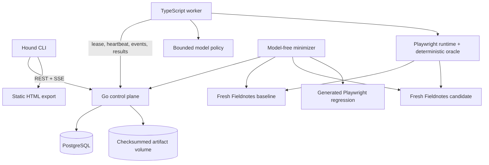

# Hound

[](https://github.com/raymondzhang1883/hound/actions/workflows/ci.yml)

Hound is a CLI-first authorization regression tester for multi-user web applications. A bounded browser agent explores a candidate, deterministic code freezes and replays suspicious behavior against fresh baseline and candidate state, and confirmed findings become ordinary Playwright regression tests.

The implemented vertical slice tests one invariant in a developer-owned collaborative document fixture:

> Once a member is removed from a workspace, that member must no longer be able to modify its documents.

Hound is a focused engineering project, not a general vulnerability scanner. The current application adapter supports the included Fieldnotes fixture. Static HTML is a secondary export; the CLI and durable result records are the source of truth.

## Run the complete demo

You need Node.js 22+, npm, Docker with Compose, and a macOS or Linux shell.

```sh
npm ci
npm run setup:browser
./hound demo
```

The demo needs no API key and makes **zero external model requests**. It starts the loopback control plane, runs fresh baseline and candidate fixtures in Chromium, feeds authored simulated responses through the production provider parser and browser controller, verifies the finding with paired replay, minimizes the plan without a model, stores the result, exports an HTML report, and executes the generated regression against both fixture variants.

Expect several minutes of runtime because deletion-minimality is tested with many fresh-state browser pairs. The final output looks like this:

```text
Confirmed paired result; policy decisions: 14; external model requests: 0.
Outcome: minimized; 14 -> 11 steps; deletion-minimal: true.
CONFIRMED  Removed member retained document write access
Pair       baseline=denied candidate=violation
Minimize   14 → 11 actions · 1 confirmation · 0 model calls
Regression generated-tests/removed-member-write.spec.ts
Generated regression rejected the seeded candidate as expected.
```

The demo prints its durable run ID and report path. Inspect the same result from the terminal at any time:

```sh
./hound runs
./hound show --run-id <run-id>
./hound report --run-id <run-id>
./hound test-generated
```

You can also review the tracked example finding report, which is a sanitized static export from the credential-free demo.

## What is technically interesting

- **Agent authority is narrow.** The policy chooses one validated click, fill, select, observe, or known-route navigation from a bounded DOM observation. It cannot run shell commands, issue arbitrary requests, execute browser code, or choose a target URL.
- **The model is outside the verdict boundary.** Authoritative state inspection establishes whether a write persisted. The same logical plan must reproduce with equivalent setup, a baseline denial, and a candidate violation.
- **Replay uses fresh state.** Recorded actions carry locator recipes and logical resource references so independently generated workspace, invitation, and document IDs can be rebound on each deployment.
- **Findings become maintainable tests.** A paired, deletion-minimal plan exports as a self-contained Playwright spec that passes on the baseline and fails on the seeded candidate.
- **Execution is durable.** A Go control plane and PostgreSQL provide queued runs, leases, epochs, heartbeats, retries, cancellation, idempotent events, stale-worker fencing, terminal completion gating, and sanitized result reads.
- **Artifacts are integrity checked.** Replay and minimized plans live in a private content-addressed volume with SHA-256 validation. Published result projections omit credentials, provider text, raw observations, HTTP bodies, addresses, and private paths.

## Architecture



The versioned application adapter contains Fieldnotes startup, fictional actor credentials, authenticated authoritative inspection, reset semantics, and cleanup. Core worker and minimizer orchestration no longer imports fixture startup directly. A second adapter is a future generalization experiment, not a current compatibility claim.

## Finding lifecycle

1. Alice and Bob receive independent authenticated browser contexts on a fresh candidate fixture.
2. The policy explores normal UI controls under a decision and cost budget.
3. Deterministic inspection recognizes a suspicious post-removal write that actually persisted.
4. Hound freezes the exact trajectory and replays it against fresh baseline and candidate fixtures.
5. A finding is confirmed only when the baseline denies the same write and the candidate reproduces it with equivalent setup.
6. The model-free minimizer tests deletions with fresh pairs and confirms the reduced plan.
7. Hound publishes a sanitized durable result, minimized replay artifact, static report, and generated Playwright test.

The included candidate intentionally trusts a retained session's cached workspace grant for writes. Both variants deny post-removal reads and fresh-session writes; only the warmed candidate session preserves the unauthorized write. Fixture acceptance tests verify that this is the sole seeded behavioral difference.

## Evidence levels

Hound keeps three kinds of evidence separate:

| Evidence | What it establishes | What it does not establish |
| --- | --- | --- |
| Deterministic tests | Runtime, oracle, replay, control-plane, minimizer, and exporter behavior | Agent discovery ability |
| Simulated-provider demo | Complete integration through real browsers and the provider wire parser | Autonomous discovery or detection rate |
| Live pilots | Actual model calls, cost, failure modes, positive runs, and negative controls | A statistically useful benchmark |

The demo's authored sequence is explicit in `services/runtime/src/demo-policy.ts` and is shared by positive and both-correct browser integrations. Measured live-pilot records and their limits are documented in agent setup and results and evaluation. A nondetection is never labeled a security pass.

## Use the CLI

Start the durable loopback stack:

```sh
./hound control up
./hound control status
./hound hunt --preflight
```

`control up` creates owner-readable random credentials in ignored `.hound/` storage, builds digest-pinned Go and PostgreSQL images, publishes only the control API on `127.0.0.1`, and leaves PostgreSQL private to the Compose network.

Live autonomous exploration is optional and is the only path that needs a provider key. Put `OPENAI_API_KEY` in the ignored project `.env`, start a worker, and submit a run from another terminal with an explicit dollar allowance:

```sh
./hound worker

# another terminal
./hound hunt --case positive --max-cost-usd 1
./hound hunt --case negative --max-cost-usd 1
```

The policy pins `gpt-5.4-mini-2026-03-17` with medium reasoning. Each command has its own allowance. Hound makes no automatic provider retry and has no hidden model fallback.

Common commands:

```text
hound demo                         credential-free complete demonstration
hound hunt ...                     submit and follow an owned-fixture hunt
hound runs                         list durable runs
hound status <run-id>              inspect lifecycle state
hound logs <run-id> --follow       stream sanitized events
hound cancel <run-id>              cancel a queued or running job
hound show --run-id <run-id>       print the sanitized durable result
hound minimize --run-id <run-id>   reduce a confirmed plan with zero model calls
hound report --run-id <run-id>     export a self-contained HTML report
hound test-generated               execute the exported baseline regression
```

Read-only commands launch no browser, fixture, or model. Direct historical runs remain available through explicit `--local` flags.

## Validate the repository

The default GitHub Actions workflow requires no secret or model credential. Equivalent local checks are:

```sh
npm run typecheck
npm test
npm run test:browser
./hound control up
npm run test:control
```

The generated regression has intentionally opposite outcomes:

```sh
npm run test:generated
HOUND_FIXTURE_MODE=stale-write npm run test:generated
```

The first command passes against the correct fixture. The second must fail with `Expected: "denied"` and `Received: "violation"`.

## Scope and limitations

- Hound currently supports one application adapter, one invariant, two fictional actors, and local owned fixtures.
- It does not infer business policy, scan arbitrary sites, or establish that an application is secure.
- The Fieldnotes target uses in-memory state and a purpose-built authenticated inspection harness.
- The simulated demo validates orchestration but does not measure autonomous agent performance.
- The live pilot sample is intentionally small and should not be used to claim a detection or false-positive rate.
- There is no hosted dashboard, public API, team account system, cloud worker, or production deployment story.

Use Hound only on systems and accounts you own or are explicitly authorized to test. See the [security policy](SECURITY.md) and [contribution guide](CONTRIBUTING.md).

## Repository map

```text
apps/fixture/              Fieldnotes state, UI, actor server, and protected harness
services/runtime/          Policy, browser execution, oracle, replay, minimizer, CLI
services/control-plane/    Go lifecycle, result, event, and artifact API
deploy/local/              Digest-pinned loopback Docker Compose stack
generated-tests/           Exported model-free Playwright regression
```

Start with the runtime contract, durable minimization decision, and CLI/report guide.

## License

Hound is available under the [MIT License](LICENSE).
